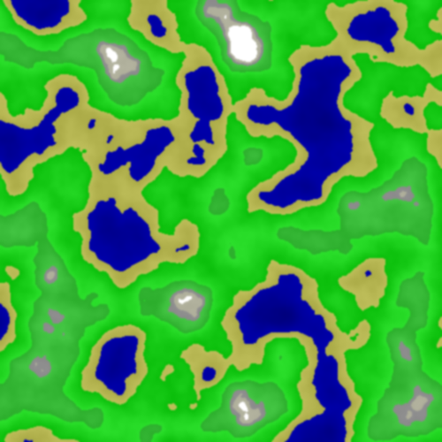
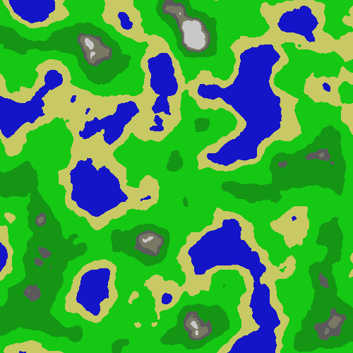
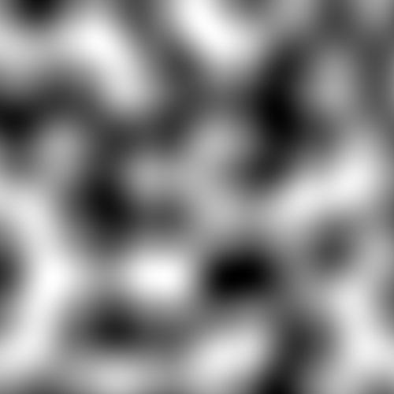
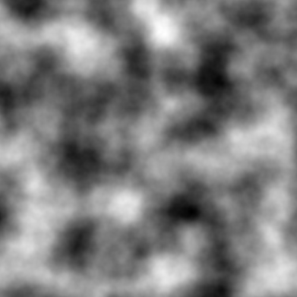

# Procedural terrain generator using Perlin noise

This is a simple procedural terrain generator which generates a bitmap image using Perlin noise. The program is written in Rust and uses the `image` crate to generate the image.

It was written for a university proseminar project and for learning Rust.

## Parameters

It has many parameters which can be tweaked in the source code to change the look of the terrain. The parameters you can change in the `main` function are:

- `width` - The width of the image in chunks
- `height` - The height of the image in chunks
- `chunk_size` - The size of a chunk in pixels

    The chunks are squares with the size `chunk_size` x `chunk_size`, so the image will have the size `width * chunk_size` x `height * chunk_size`.

- `seed` - The seed for the random number generator (`random()` by default)

The parameters you can change in the `Perlin::generate_octaves()` function call are:

- `count` - The number of fractal noise octaves
- `persistence` - The persistence of the fractal noise (by how much the amplitude decreases with each octave)
- `lacunarity` - The lacunarity of the fractal noise (how smaller the chunk size is with each octave)

It is also possible to change the color mapping by changing the `match` statement in the `perlin_to_terrain()` function.

The program consists of 2 source files:

- `main.rs` - The main function and the image generation
- `perlin.rs` - The Perlin noise generator

## Example Outputs

After running the program, it will save 4 images in the current directory:

terrain.png - The final terrain image

raw_terrain.png - The terrain image before applying extra noise on top of it and blur

perlin.png - The generated Perlin noise (before applying fractal octaves)

perlin_fractal.png - The generated fractal Perlin noise

#
# Proceduralny generator terenu wykorzystujący szum Perlina

Prosty proceduralny generator terenu, który generuje bitmapę wykorzystując do tego szum Perlina. Program napisany jest w języku Rust i wykorzystuje bibliotekę `image` do generowania obrazów.

Program został jako projekt proseminaryjny na uczelnię oraz do nauki języka Rust.

## Parametry

Program posiada wiele parametrów, które można zmieniać w kodzie źródłowym, aby zmienić wygląd terenu. Parametry które można zmienić w funkcji `main` to:

- `width` - Szerokość obrazu w chunkach
- `height` - Wysokość obrazu w chunkach
- `chunk_size` - Rozmiar chunka w pikselach

    Chunki są kwadratami o rozmiarze `chunk_size` x `chunk_size`, więc obraz będzie miał rozmiar `width * chunk_size` x `height * chunk_size`.

- `seed` - Ziarno generatora liczb losowych (domyślnie `random()`)

Parametry które można zmienić w wywołaniu funkcji `Perlin::generate_octaves()` to:

- `count` - Liczba oktaw szumu fraktalowego
- `persistence` - Trwałość szumu fraktalowego (o ile zmniejsza się amplituda z każdą oktawą)
- `lacunarity` - Lakunarność szumu fraktalowego (o ile mniejsze są chunki w każdej kolejnej oktawie)

Możliwa jest również zmiana mapowania kolorów poprzez edycję instrukcji `match` w funkcji `perlin_to_terrain()`.

Program składa się z 2 plików źródłowych:

- `main.rs` - Funkcja główna i generowanie obrazu
- `perlin.rs` - Generator szumu Perlina

## Przykładowe wyniki

Po uruchomieniu programu, zostaną zapisane 4 obrazy w bieżącym katalogu:

terrain.png - Ostateczny obraz terenu

raw_terrain.png - Obraz terenu przed dodaniem dodatkowego szumu i rozmycia

perlin.png - Wygenerowany szum Perlina (przed dodaniem oktaw fraktalowych)

perlin_fractal.png - Wygenerowany fraktalowy szum Perlina

